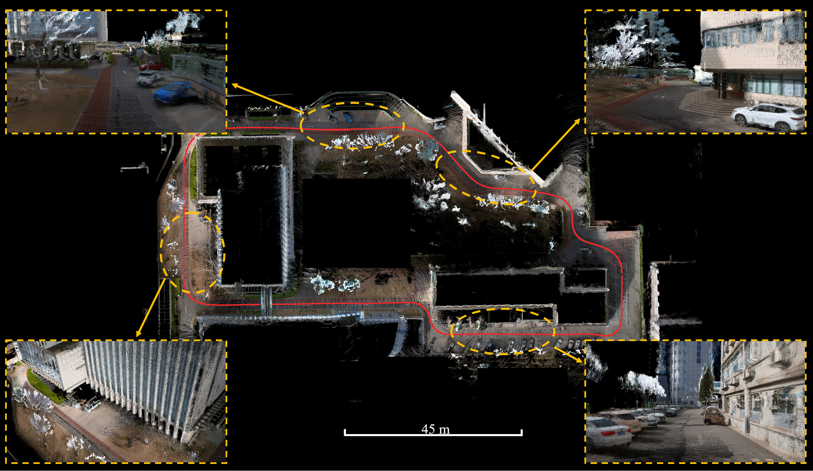

# PanoVLM: Low-Cost and Accurate Panoramic Vision and LiDAR Fused Mapping

PanoVLM is a mapping method that uses panoramic camera and LiDAR for dense mapping. Distinct from other fusion-based methods, PanoVLM eliminates the need for strict synchronization and reliance on auxiliary sensors like IMU or GNSS, positioning itself as a low-cost yet accurate mapping solution.

## Dataset

With our data acquisition devices, five different datasets are collected, namely Room, Floor, Building, Campus-Small, and Campus-Large.

## Mapping Result

The dense mapping result in Building and Campus-Large datasets.

