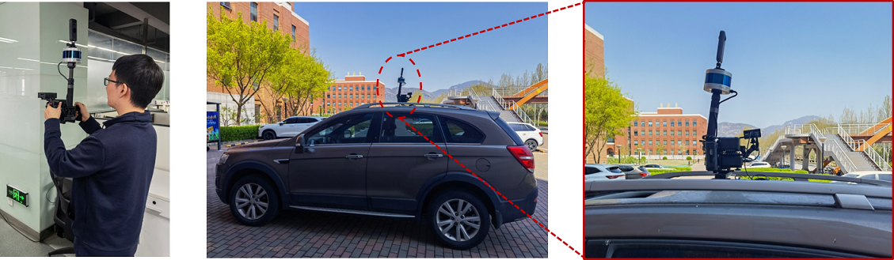

# PanoVLM: Low-Cost and Accurate Panoramic Vision and LiDAR Fused Mapping

## Abstract
Cameras and LiDARs are currently two types of sensors commonly used for 3D mapping. Vision-based methods are susceptible to textureless regions and lighting, and LiDAR-based methods easily degenerate in scenes with insignificant structural features. Most current fusion-based methods require strict synchronization between the camera and LiDAR and also need auxiliary sensors, such as IMU. All of these lead to an increase in device cost and complexity. To address that, in this paper, we propose a low-cost mapping pipeline called PanoVLM that only requires a panoramic camera and a LiDAR without strict synchronization. Firstly, camera poses are estimated by a LiDAR-assisted global Structure-from-Motion, and LiDAR poses are derived with the initial camera-LiDAR relative pose. Then, line-to-line and point-to-plane associations are established between LiDAR point clouds, which are used to further refine LiDAR poses and remove motion distortion. With the initial sensor poses, line-to-line correspondences are established between images and LiDARs to refine their poses jointly. The final step, joint panoramic Multi-View Stereo, estimates the depth map for each panoramic image and fuses them into a complete dense 3D map. Experimental results show that PanoVLM can work on various scenarios and outperforms state-of-the-art (SOTA) vision-based and LiDAR-based methods.

## Pipeline

The pipeline of PanoVLM can be divided into three steps.
1. Inputs: panoramic images and LiDAR point clouds, which are not strictly synchronized.
2. Step1: initial pose estimation, which is based on global Structure-from-Motion (SfM). The initial camera poses are estimated by SfM, and the initial LiDAR poses are derived with the initial camera-LiDAR relative pose. Then, the LiDAR poses are optimized by line-to-line and point-to-plane associations between LiDAR clouds.
3. Step2: joint pose refinement, which is based on line-to-line correspondences between images and LiDARs. The camera poses and LiDAR poses are refined jointly.
4. Step3: joint panoramic Multi-View Stereo (MVS), which estimates the depth map for each panoramic image and fuses them into a complete dense 3D map.
5. Outputs: camera and LiDAR poses, and a dense 3D map.

The following figure shows the pipeline of PanoVLM.


## Software Dependencies

- [OpenCV 3.4.0](https://opencv.org/)
- [PCL 1.10](https://pointclouds.org/)
- [Ceres 2.0.0](http://ceres-solver.org/)
- [Eigen 3.4](http://eigen.tuxfamily.org/index.php?title=Main_Page)
- [Boost 1.71.0](https://www.boost.org/)

Most of the SfM codes are adopted from [openMVG](https://github.com/openMVG/openMVG).

Most of the MVS codes are adopted from [openMVS](https://github.com/cdcseacave/openMVS).

## Codes

For the details of the codes, please refer to the [Tutorial](./Tutorial.md).

## Data Acquisition Device

Our data acquisition device contains the following componets:
- An Insta 360 One X2, which is a lightweight and compact panoramic camera with a dual-fisheye lens. The resolution of the panoramic video is 5.7K@30fps.
- A Velodyne VLP-16 LiDAR, which is the cheapest and lightest product in all Velodyne mechanical LiDARs.
- A Raspberry Pi 4B (with a small screen), which is a low-cost embedded board based on ARM, is used to start/stop the camera and the LiDAR and store the LiDAR data. The panoramic video is stored on the camera's own memory card.
- A battery is used to provide energy for all devices.

The VLP-16 is connected to the Raspberry Pi 4B via Ethernet, and the camera is connected to the Raspberry Pi 4B via Wi-Fi. On the Raspberry Pi 4B, a small screen is used to display the timestamp of the LiDAR data, which is used to roughly synchronize the LiDAR and the camera.

The following figure shows the device.


As our device is very light and compact, it can be easily carried by a person or mounted on a car. The following figure shows the device mounted on a car.



## Roughly Synchonization

As our device does not have hardware synchronization, we use the timestamp on the screen to roughly synchronize the panoramic camera and LiDAR. Each complete LiDAR scan (0.1s per scan) is sent in dozens of *pcap* packets, and each packet contains a timestamp, which is displayed on the screen. However, the amount of *pcap* packets is too large, so the screen is refreshed every 0.5s. 
To roughly synchronize the two types of data, from the beginning of the panoramic video, we manually choose a frame that the screen content is just refreshed, and we regard this frame and the corresponding *pcap* packet as synchronous.
We also repeat the same steps at the end of the video to get roughly synchronized data.
For the roughly synchronized data, we perform uniform sampling at equal intervals in the middle part, i.e., we sample images at 10 frames per second. For the *pcap* packets, we aggregate them every 100ms into a complete LiDAR data frame.

The following figures show the timestamp cptured by the camera and the schematic diagram of the roughly synchronization.


## Dataset

With our data acquisition devices, five different datasets are collected, including two indoor datasets and three outdoor datasets. The following table shows the details of the datasets.

| Dataset      | \#Frames | Length(m) | GT pose | Environment | Download Link |
| :-----:      | :------: | :-------: | :-----: | :---------: | :-----------: |
| Room         |   454    |   14.22   |   No    |   Indoor    | [link](https://drive.google.com/file/d/1HOvOy4WI93J7dQxvZ8ErAX15Qbh5q0ps/view?usp=sharing) |
| Floor        |   1593    |   182.39   |   No    |   Indoor    | [link](https://drive.google.com/file/d/1UvyMLn_n2fGeiRPSqCttdGJYFajTxMYE/view?usp=sharing) |
| Building     |   1724   |   482.81  |   No    |   Outdoor   |
| Campus-Small |   824    |  216.80   |   Yes   |   Outdoor   |
| Campus-Large |   8730   |  3557.63  |   Yes   |   Outdoor   |


**note**: The origin datasets of Room and Floor are sampled at 10 frames per second. For indoor SfM, the sample rate is too high, so we downsample the datasets to reduce data. 

We are currently sorting out datasets Building, Cmpus-Small and Campus-Large. The download link will be updated soon.

## Mapping Result

The dense mapping result in Building and Campus-Large datasets.


## Cite
``` 
@article{TU2023149,
title = {PanoVLM: Low-Cost and accurate panoramic vision and LiDAR fused mapping},
author = {Diantao Tu and Hainan Cui and Shuhan Shen},
journal = {ISPRS Journal of Photogrammetry and Remote Sensing},
volume = {206},
pages = {149-167},
year = {2023},
issn = {0924-2716},
doi = {https://doi.org/10.1016/j.isprsjprs.2023.11.012}
}
```